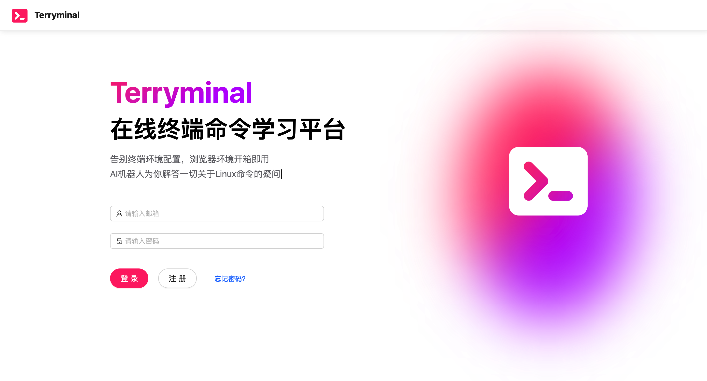
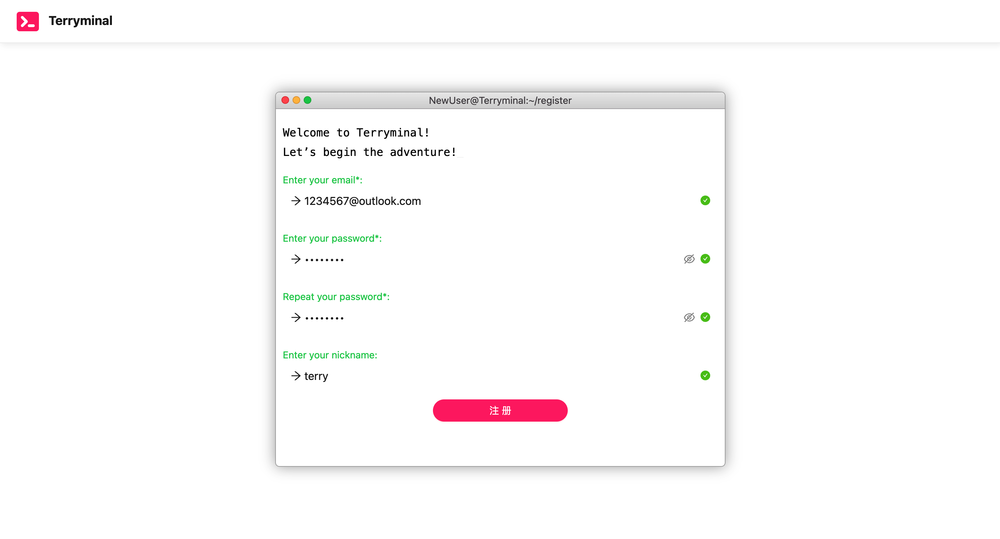
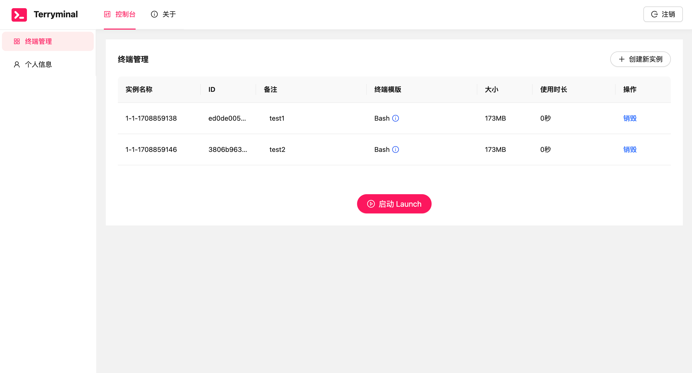
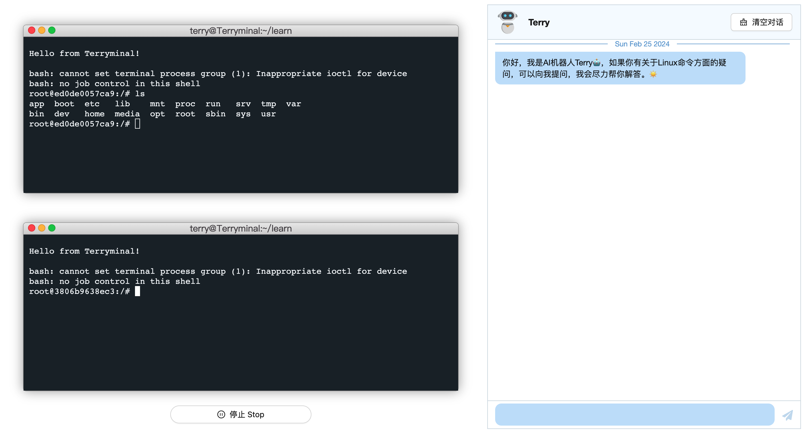

# 
Terryminal

一款在线终端命令学习平台！

- 告别终端环境配置，浏览器环境开箱即用
- AI机器人为你解答一切关于Linux命令的疑问

## 界面演示

#### 1. 登录 / 注册

#### 2. 控制台 / 终端窗口 / AI机器人

## 主要依赖

- [**React**](https://github.com/facebook/react)
- [**Ant Design**](https://github.com/ant-design/ant-design)
- [**Marked**](https://github.com/markedjs/marked)（Markdown文本解析）
- [**Typed.js**](https://github.com/mattboldt/typed.js)（打字效果库）
- [**Xterm**](https://github.com/xtermjs/xterm.js)（网页终端样式库）

## 接口文档

[**API 文档**](https://www.apifox.cn/apidoc/shared-3e28c033-bc0d-436e-93de-6f0e6045d53d)
